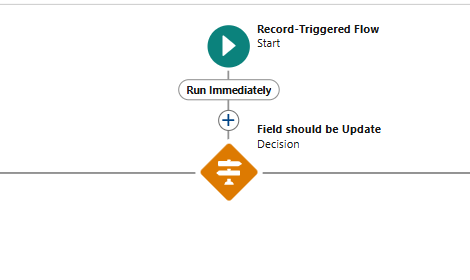

# RentEase - A Comprehensive Salesforce CRM for Laptop Rental Services

)

## Table of Contents
1. [Project Overview](#project-overview)
2. [Objectives](#objectives)
3. [Key Features](#key-features)
4. [System Architecture](#system-architecture)
5. [Modules](#modules)
6. [Implementation Steps](#implementation-steps)
7. [Technologies Used](#technologies-used)
8. [Testing and Validation](#testing-and-validation)
9. [Challenges and Solutions](#challenges-and-solutions)
10. [Future Enhancements](#future-enhancements)
11. [Screenshots](#screenshots)
12. [Conclusion](#conclusion)

---

## Project Overview
RentEase is a robust CRM solution built on Salesforce, designed for managing the end-to-end processes of laptop rental businesses. It centralizes inventory management, automates workflows, and enhances customer engagement. By optimizing the rental lifecycle, RentEase provides a seamless experience for both businesses and customers.

## Objectives
- **Business Goals**:
  - Improve customer satisfaction with personalized engagement.
  - Automate key processes to reduce manual intervention.
  - Provide data-driven insights for strategic decision-making.
- **Specific Outcomes**:
  - Effective inventory tracking for laptops.
  - Streamlined booking and billing operations.
  - Centralized management of customer data.

## Key Features
- **Custom Objects**: Manage laptops, customers, bookings, and billing processes.
- **Validation Rules**: Ensure data integrity by validating mandatory fields like email and phone numbers.
- **Automations**:
  - Flows for notifications and status updates.
  - Apex triggers for managing inventory and automated workflows.
- **Reports & Dashboards**: Provide insights into revenue trends, inventory, and bookings.
- **User Roles & Permissions**: Secure access levels for roles like Owner and Agent.

## System Architecture
The system architecture comprises:
- **Database**: Salesforce custom objects for data storage.
- **Business Logic**: Apex code for workflows and automations.
- **User Interface**: Salesforce Lightning Experience for a seamless and intuitive frontend.

## Modules
1. **Inventory Management**: Track laptop availability and specifications.
2. **Customer Management**: Manage customer profiles and interaction history.
3. **Laptop Booking**: Automate the reservation and return process.
4. **Billing Automation**: Simplify invoice generation and payment tracking.
5. **Reports & Dashboards**: Real-time analytics for business insights.

## Implementation Steps
1. **Custom Object Creation**:
   - Total Laptops: Tracks laptop details and availability.
   - Consumer: Stores customer details.
   - Laptop Bookings: Manages booking data.
   - Billing Process: Handles invoice and payment information.

2. **Lightning App Configuration**:
   - Created tabs for Total Laptops, Consumer, Laptop Bookings, and Billing Process.
   - Developed the unified "Laptop Rentals" Lightning App.

3. **Automations**:
   - Flows: Automated booking confirmations and inventory updates.
   - Apex Triggers: Ensured data consistency across objects.

4. **Reports & Dashboards**:
   - Metrics include available laptops, active bookings, and revenue trends.

## Technologies Used
- Salesforce Lightning Platform
- Apex Classes and Triggers
- Salesforce Flows
- Reports and Dashboards

## Testing and Validation
- **Unit Testing**:
  - Tested Apex classes and triggers for functionality and performance.
- **User Interface Testing**:
  - Verified forms, tabs, and dashboards for usability.

## Challenges and Solutions
- **Challenge**: Managing large datasets efficiently.
  - **Solution**: Used optimized queries and indexing in Salesforce.
- **Challenge**: Real-time updates for bookings.
  - **Solution**: Implemented flows for instant notifications and inventory updates.

## Future Enhancements
1. Integration with payment gateways for secure transactions.
2. AI-based recommendation systems for personalized rentals.
3. Mobile app support for better accessibility.

## Screenshots
### 1. **Flows**

### 2. **Flows**

### 3. **Dashboard**

---

## Conclusion
RentEase is a comprehensive Salesforce-based CRM tailored for the laptop rental business. It streamlines operations, automates workflows, and improves customer satisfaction. The system is scalable, with potential enhancements to adapt to evolving business needs.

---

## How to Run
1. Import the RentEase metadata into your Salesforce org.
2. Configure custom objects, validation rules, and flows as per the documentation.
3. Assign roles and permissions for users.
4. Test the system using the provided test cases and Apex classes.

---

## Authors
- **Manohar Singh**

---

## Contact
For questions or support, please contact:
- **Email**:burathimannu@gmail.com
- **LinkedIn**: [Manohar Singh](https://www.linkedin.com/in/manohar-singh-a50390222/)
